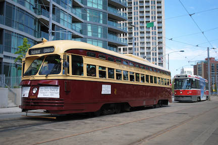

---
title:
author: "cjlortie"
date: "2017"
output:
  html_document:
    theme: spacelab
    toc: yes
    toc_depth: 3
    toc_float: yes
  pdf_document:
    toc: yes
---
#ttc data
###Purpose
To explore the importance of delays and patterns in public transit using open data from city of Toronto, Canada.

Data from [Toronto Open Data]( http://www1.toronto.ca/wps/portal/contentonly?vgnextoid=fa6be8c5a612c510VgnVCM10000071d60f89RCRD&vgnextchannel=1a66e03bb8d1e310VgnVCM10000071d60f89RCRD)

Delay codes listed in two tables provided.


<br>


###Data wrangle
```{r loads, warning=FALSE, message=FALSE, echo=FALSE}
library(tidyverse)
meta.data <- read_csv("data/meta-data.csv")
library(DT)
datatable(meta.data)


```